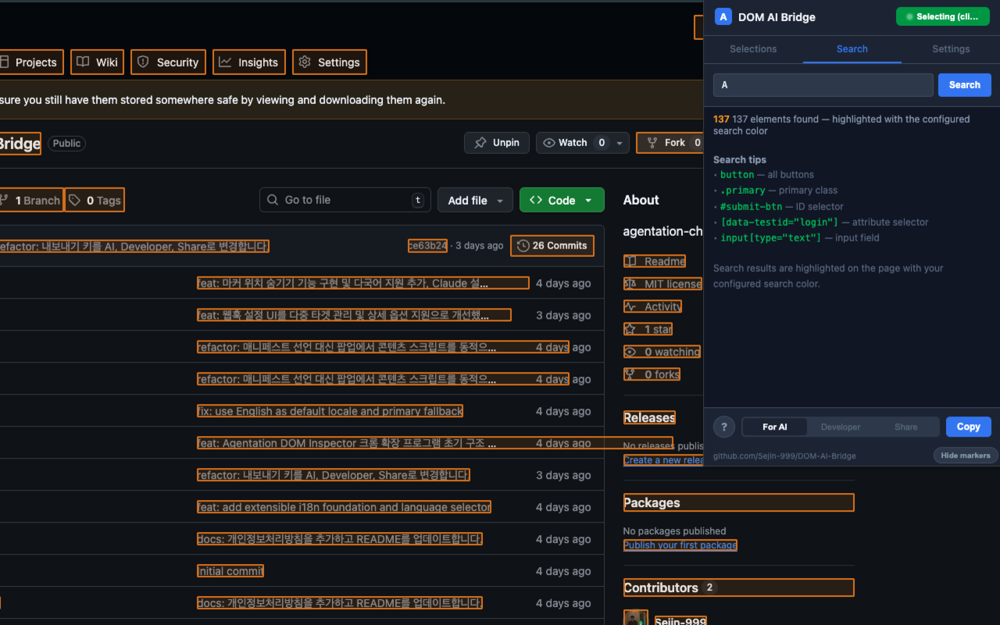
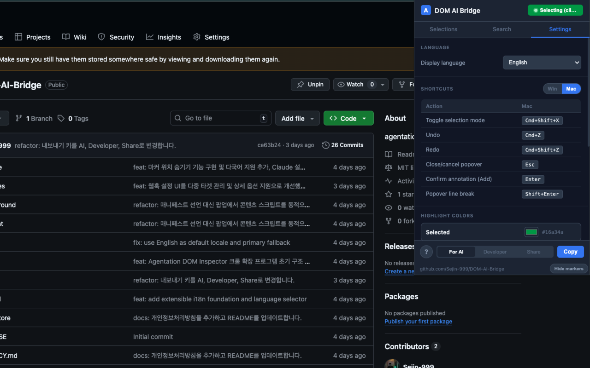
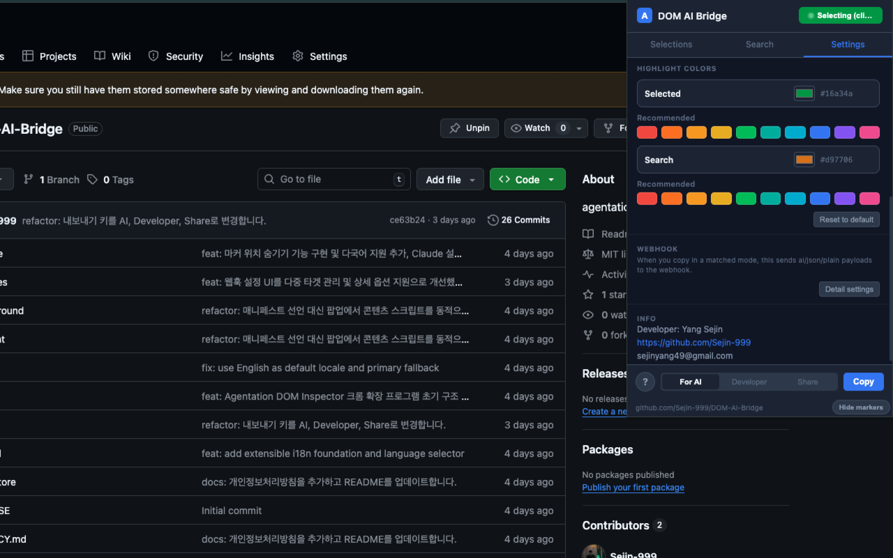
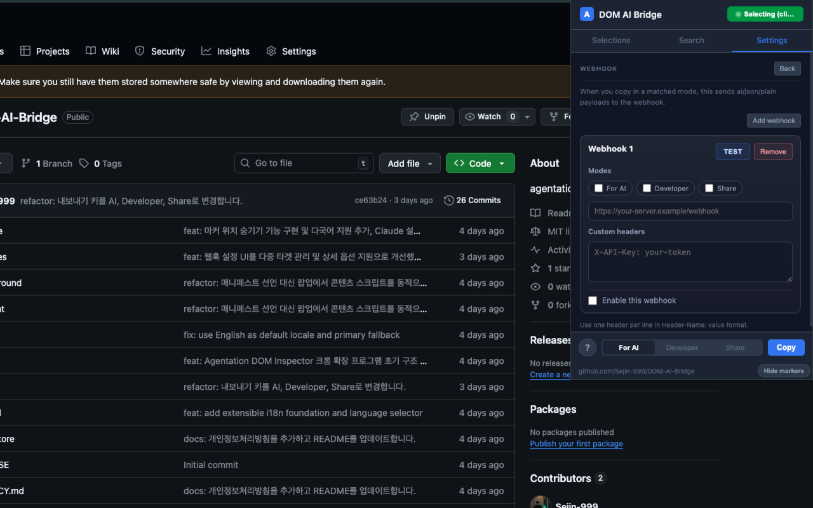

<div align="right">
  <a href="./README.md">🇰🇷 한국어</a> &nbsp;|&nbsp;
  <a href="./README.en.md"><b>🇺🇸 English</b></a>
</div>

<br>

<div align="center">
  
  <h1>DOM AI Bridge</h1>
  <p>A Chrome extension that lets you click DOM elements on any webpage and export them directly as AI prompts.</p>
  <p>Works on <b>any web environment</b> — JSP, Thymeleaf, Vanilla JS, and more. No framework required.</p>

  <br>

  <a href="https://github.com/Sejin-999/DOM-AI-Bridge">
    
  </a>
  
  
</div>

<br>



---

<details>
<summary><b>💡 Why was this built?</b></summary>

<br>

I'm a backend developer based in Korea.
While exploring vibe coding, I came across [Agentation](https://agentation.dev/) and found it genuinely useful.

However, Agentation works best with React-based projects. Since I primarily work with Java-side frontends like Thymeleaf and JSP — as well as Vanilla JavaScript — I kept running into friction when trying to apply it.

So I decided to build a framework-agnostic tool that works out of the box on any web environment, in the spirit of Agentation.

</details>

---

## How to use

**Just 4 steps.**

| Step | Description |
|------|-------------|
| 1. Start the extension | Click **Start Selecting** in the popup |
| 2. Select elements | Click any DOM element on the page |
| 3. Add annotation | Type *"change this like..."* in the popover |
| 4. Export | Choose a format, hit **Copy**, paste into your AI |

<table>
  <tr>
    <td align="center"><b>① Default state</b></td>
    <td align="center"><b>② Elements selected</b></td>
  </tr>
  <tr>
    <td></td>
    <td></td>
  </tr>
</table>

---

## Export formats

Your selected elements are instantly converted into the format that fits your workflow.

### 🤖 AI format (optimized for Claude, Cursor, etc.)

```markdown
# UI Annotations
**Page:** https://example.com
**Elements:** 2

---
**[1] BUTTON** `button.primary`
Text: "Login"
> Please change the button color to blue

---
**[2] H1** `#main-title`
Text: "Welcome"
> Please increase the font size
```

### 👨‍💻 Developer format (includes selector strategy, position, attributes)

```markdown
## DOM Selections — https://example.com
> Total: 2 elements

### 1. BUTTON — "Login"
- **Selector**: `button.primary`
- **Strategy**: class
- **Position**: (120, 340) 80×36px
- **Annotation**: Please change the button color to blue
```

### 🔗 Share format (plain text for designers and planners)

```
UI Annotations — https://example.com
2 elements total

1. BUTTON (button.primary)
   Text: "Login"
   Annotation: Please change the button color to blue
```

---

## Features

### DOM Selection & Annotation
- Click to select elements, with auto-numbered badges
- Annotation popover (press Enter to add quickly)
- Undo / Redo (up to 50 steps)
- Auto CSS selector generation (ID → semantic attributes → class combinations → path)

### Search
- Search elements on the page by CSS selector with highlight

### Settings

<table>
  <tr>
    <td align="center"><b>Language</b></td>
    <td align="center"><b>Highlight colors</b></td>
    <td align="center"><b>WebHook</b></td>
  </tr>
  <tr>
    <td></td>
    <td></td>
    <td></td>
  </tr>
</table>

- **Multilingual**: Korean / English / Japanese
- **Color customization**: Change selected/search highlight colors
- **WebHook**: Auto-send annotation data to external servers (up to 3 targets)
- **Keyboard shortcuts**: `Ctrl/Cmd + Shift + X` toggle, `Esc` exit, `Ctrl+Z` undo

---

## Installation

### Chrome Web Store (coming soon)
> Link will be updated once the review is complete.

### Load as unpacked extension (developer mode)

```bash
# 1. Clone the repo
git clone https://github.com/Sejin-999/DOM-AI-Bridge.git

# 2. Open Chrome and navigate to
chrome://extensions/

# 3. Enable "Developer mode" (top right)
# 4. Click "Load unpacked"
# 5. Select the cloned folder
```

---

## Roadmap

### MCP server-based AI automation

Currently, the flow is manual: Copy → paste into AI.
With MCP server integration, the goal is full automation: **select DOM → AI → code applied**.

- Server repo: [DOM-AI-Bridge-Server](https://github.com/Sejin-999/DOM-AI-Bridge-Server)

---

## Privacy

- All data is processed **locally only**
- No user data is stored on external servers
- Works in air-gapped environments

Details: [Privacy Policy](./PRIVACY.md)

---

## Open Source

Anyone can access the code and contribute.

- Main repo: [Sejin-999/DOM-AI-Bridge](https://github.com/Sejin-999/DOM-AI-Bridge)
- Server repo: [Sejin-999/DOM-AI-Bridge-Server](https://github.com/Sejin-999/DOM-AI-Bridge-Server)

### How to contribute

We accept PRs in two types.

| Type | PR title format | Description |
|------|----------------|-------------|
| Feature | `Feat: description` | New feature implementation or bug fix |
| Translation | `Lang: language name` | Add a new language or improve existing translations |

If this helped you, a GitHub ⭐ Star would mean a lot!
