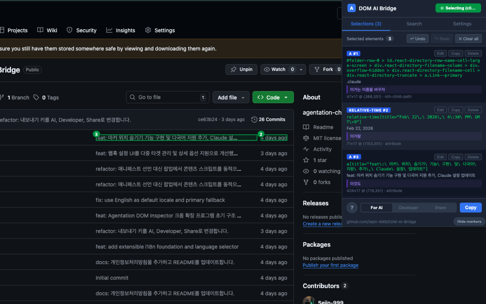
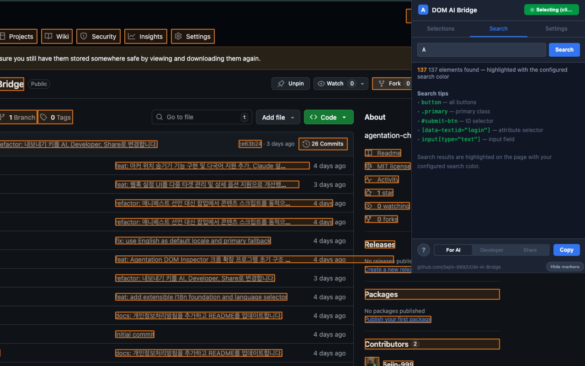
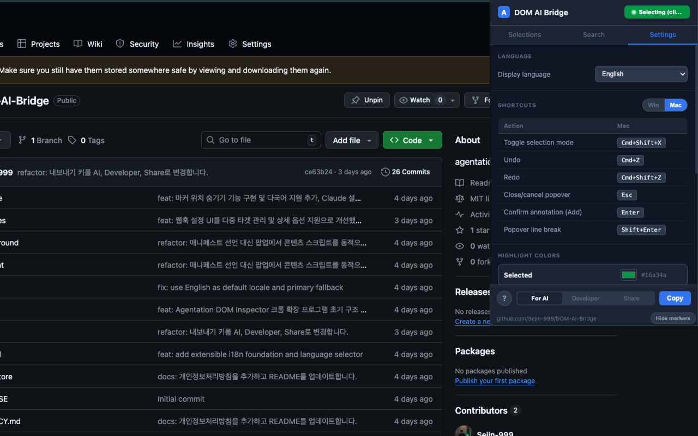
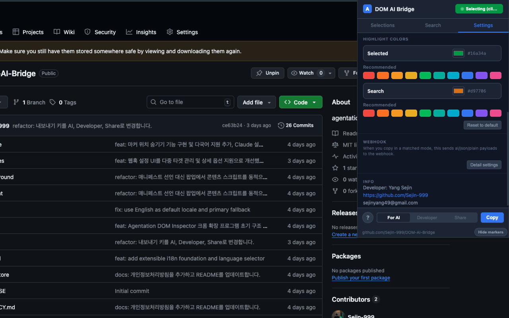
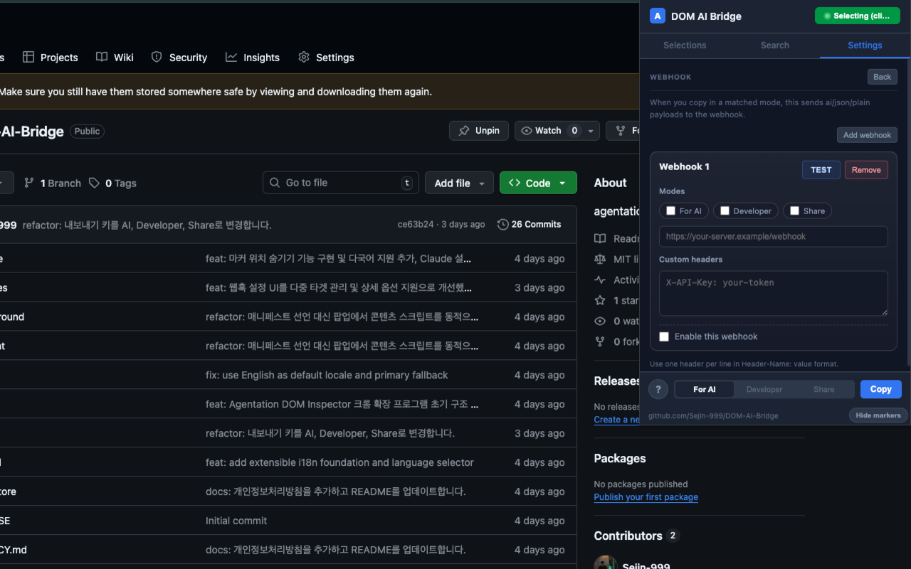

<div align="right">
  <a href="./README.md">🇰🇷 한국어</a> &nbsp;|&nbsp;
  <a href="./README.en.md"><b>🇺🇸 English</b></a>
</div>

<br>

<div align="center">
  
  <h1>DOM AI Bridge</h1>

  <h2><a href = "https://chromewebstore.google.com/detail/dom-ai-bridge/gipfclelhppmafdlajajjkfepiiccnfd">Click & Install!</a></h2>
  
  <p>A Chrome extension that lets you click DOM elements on any webpage and export them directly as AI prompts.</p>
  <p>Reads the real DOM directly — no virtual DOM dependency. Works on <b>any web environment</b>.</p>
  <p>🌐 <a href="https://dom-ai-bridge.pages.dev/">Official site</a> (in development)</p>

  <br>

  <a href="https://github.com/Sejin-999/DOM-AI-Bridge">
    
  </a>
  
  
</div>

<br>



---

<details>
<summary><b>💡 Why was this built?</b></summary>

<br>

I'm a backend developer based in Korea.
While exploring vibe coding, I came across [Agentation](https://agentation.dev/) and found it genuinely useful.

However, Agentation works best with React-based projects. Since I primarily work with Java-side frontends like Thymeleaf and JSP — as well as Vanilla JavaScript — I kept running into friction when trying to apply it.

So I decided to build a framework-agnostic tool that works out of the box on any web environment, in the spirit of Agentation.

</details>

---

## How to use

**Just 4 steps.**

| Step | Description |
|------|-------------|
| 1. Start the extension | Click **Start Selecting** in the popup |
| 2. Select elements | Click any DOM element on the page |
| 3. Add annotation | Type *"change this like..."* in the popover |
| 4. Export | Choose a format, hit **Copy**, paste into your AI |

<table>
  <tr>
    <td align="center"><b>① Elements selected</b></td>
    <td align="center"><b>② Search feature</b></td>
  </tr>
  <tr>
    <td></td>
    <td></td>
  </tr>
</table>

---

## Export formats

Your selected elements are instantly converted into the format that fits your workflow.

### 🤖 AI format (optimized for Claude, Cursor, etc.)

```markdown
# UI Annotations
**Page:** https://example.com
**Elements:** 2

---
**[1] BUTTON** `button.primary`
Text: "Login"
> Please change the button color to blue

---
**[2] H1** `#main-title`
Text: "Welcome"
> Please increase the font size
```

### 👨‍💻 Developer format (includes selector strategy, position, attributes)

```markdown
## DOM Selections — https://example.com
> Total: 2 elements

### 1. BUTTON — "Login"
- **Selector**: `button.primary`
- **Strategy**: class
- **Position**: (120, 340) 80×36px
- **Annotation**: Please change the button color to blue
```

### 🔗 Share format (plain text for designers and planners)

```
UI Annotations — https://example.com
2 elements total

1. BUTTON (button.primary)
   Text: "Login"
   Annotation: Please change the button color to blue
```

---

## Features

### DOM Selection & Annotation
- Click to select elements, with auto-numbered badges
- Annotation popover (press Enter to add quickly)
- Undo / Redo (up to 50 steps)
- Auto CSS selector generation (ID → semantic attributes → class combinations → path)

### Search
- Search elements on the page by CSS selector with highlight

### Settings

<table>
  <tr>
    <td align="center"><b>Language</b></td>
    <td align="center"><b>Highlight colors</b></td>
    <td align="center"><b>WebHook</b></td>
  </tr>
  <tr>
    <td></td>
    <td></td>
    <td></td>
  </tr>
</table>

- **Multilingual**: Korean / English / Japanese
- **Color customization**: Change selected/search highlight colors
- **WebHook**: Auto-send annotation data to external servers (up to 3 targets)
- **Keyboard shortcuts**: `Ctrl/Cmd + Shift + X` toggle, `Esc` exit, `Ctrl+Z` undo

---

## Installation

### Chrome Web Store (V.1.0.1)
> <a href = "https://chromewebstore.google.com/detail/dom-ai-bridge/gipfclelhppmafdlajajjkfepiiccnfd"> Download V 1.0.1 </a>

### Load as unpacked extension (developer mode)

```bash
# 1. Clone the repo
git clone https://github.com/Sejin-999/DOM-AI-Bridge.git

# 2. Open Chrome and navigate to
chrome://extensions/

# 3. Enable "Developer mode" (top right)
# 4. Click "Load unpacked"
# 5. Select the cloned folder
```

---

## Connecting with AI agents

DOM AI Bridge supports two flows.

### Manual flow (default)

```
Copy in extension → paste directly into your AI tool
```

### Local bridge server (automated)

Use [DOM-AI-Bridge-Server](https://github.com/Sejin-999/DOM-AI-Bridge-Server) alongside the extension to **send annotations directly to CLI-based AI agents** like Claude Code or Cursor — no manual pasting required.

```
Extension WebHook → local server (127.0.0.1:4180) → bridge client → AI agent
```

The bridge client supports 4 delivery modes:

| Mode | Description |
|------|-------------|
| `stdout` | Print to console |
| `clipboard` | Copy to clipboard |
| `frontmost` | Auto-paste into the focused app (Cursor, Claude, etc.) |
| `tmux` | Send to a specified tmux pane |

→ Server repo: [Sejin-999/DOM-AI-Bridge-Server](https://github.com/Sejin-999/DOM-AI-Bridge-Server)

### Coming soon: MCP server

MCP server integration is planned for deeper automation — **select DOM → AI → code applied** end-to-end.

---

## Changelog

### v1.0.3
**New Features**
- Console error log collection and export (error include toggle)
- WebSocket error detection
- Error buffering to recover logs lost before content script loads
- Copy error log even when no elements are selected

**Bug Fixes**
- Fixed toggle button text being clipped on restricted pages (chrome://)

---

### v1.0.2
**New Features**
- iframe element selection with frame context in exports
- Search highlight scroll position sync
- Content script modularization (overlay and content split into focused files)

**Bug Fixes**
- Fixed search highlight box not following scroll position
- Fixed iframe inner elements not being selectable

---

### v1.0.1
**New Features**
- Webhook multi-target management with detailed options
- Export format labels updated (AI / Developer / Share)
- Japanese (ja) locale added, i18n foundation introduced
- Marker visibility toggle
- SPA route change detection (pushState patch + MutationObserver)

**Bug Fixes**
- Fixed stale highlights remaining after route change
- Fixed default locale fallback order

---

### v1.0.0
**New Features**
- DOM element selection with numbered badges
- Automatic CSS selector generation (ID > attribute > class > nth-child)
- Annotation popover (Enter=save, Shift+Enter=newline, Esc=cancel)
- Undo / Redo (up to 50 steps)
- Export: AI Markdown / Developer Markdown / Plain Text / JSON
- Hover / Selected / Search highlights
- Draggable counter toolbar
- Drag threshold to prevent accidental selection, large container blocking
- Shortcuts: Ctrl/Cmd+Shift+X toggle, Ctrl+Z/Y undo/redo

---

## Privacy

- All data is processed **locally only**
- No user data is stored on external servers
- Works in air-gapped environments

Details: [Privacy Policy](./PRIVACY.md)

---

## Open Source

Anyone can access the code and contribute.

- Main repo: [Sejin-999/DOM-AI-Bridge](https://github.com/Sejin-999/DOM-AI-Bridge)
- Server repo: [Sejin-999/DOM-AI-Bridge-Server](https://github.com/Sejin-999/DOM-AI-Bridge-Server)

### How to contribute

| Type | Format | Description | Badge |
|------|--------|-------------|:-----:|
| Feature | PR — `Feat: description` | New feature implementation or bug fix | 💻 |
| Translation | PR — `Lang: language name` | Add a new language or improve existing translations | 📖 |
| Idea | Issue — `Idea: description` | Feature ideas or improvement suggestions | 🤔 |

Before contributing source code, please read [SOURCE_FILES.md](./SOURCE_FILES.md) first to understand file responsibilities and entry points.

### Contributors

[](#contributors-)

<!-- ALL-CONTRIBUTORS-LIST:START - Do not remove or modify this section -->
<!-- prettier-ignore-start -->
<!-- markdownlint-disable -->
<table>
  <tbody>
    <tr>
      <td align="center" valign="top" width="120px">
        <a href="https://github.com/Sejin-999">
          
          <br /><sub><b>Sejin</b></sub>
        </a>
        <br />💻 🤔 📖 🎨
      </td>
      <td align="center" valign="top" width="120px">
        <a href="https://github.com/mbk1991">
          
          <br /><sub><b>mbk1991</b></sub>
        </a>
        <br />🤔
      </td>
    </tr>
  </tbody>
</table>
<!-- markdownlint-restore -->
<!-- prettier-ignore-end -->
<!-- ALL-CONTRIBUTORS-LIST:END -->

If this helped you, a GitHub ⭐ Star would mean a lot!
